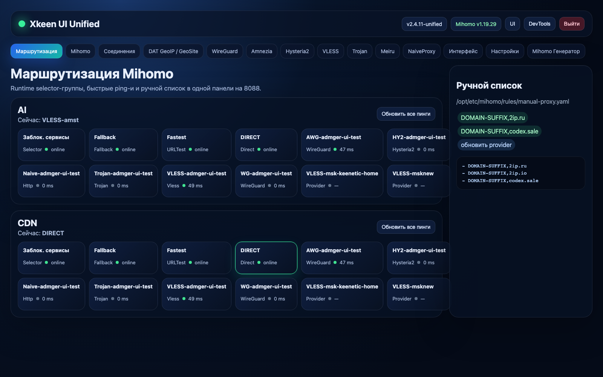
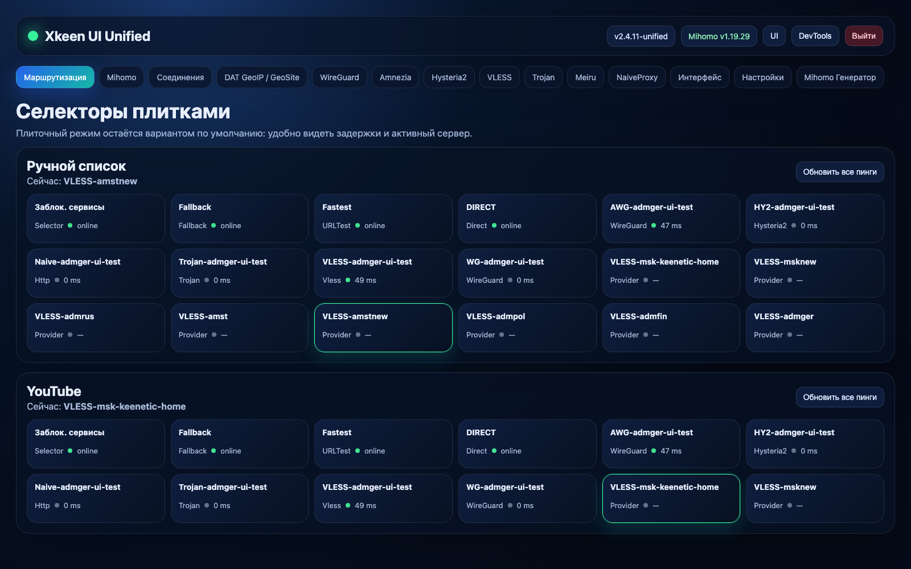
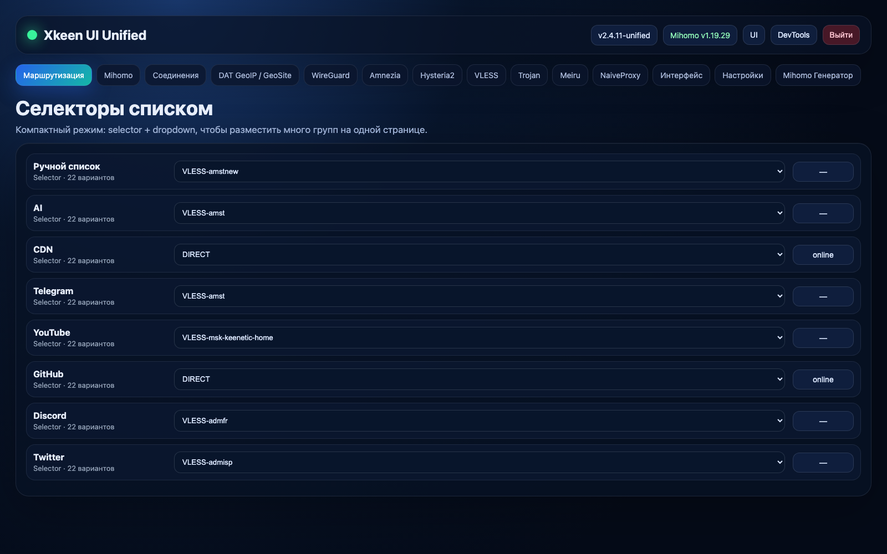
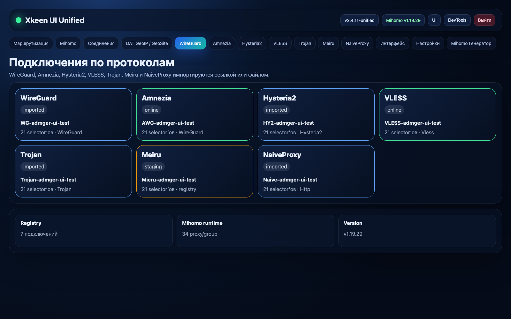
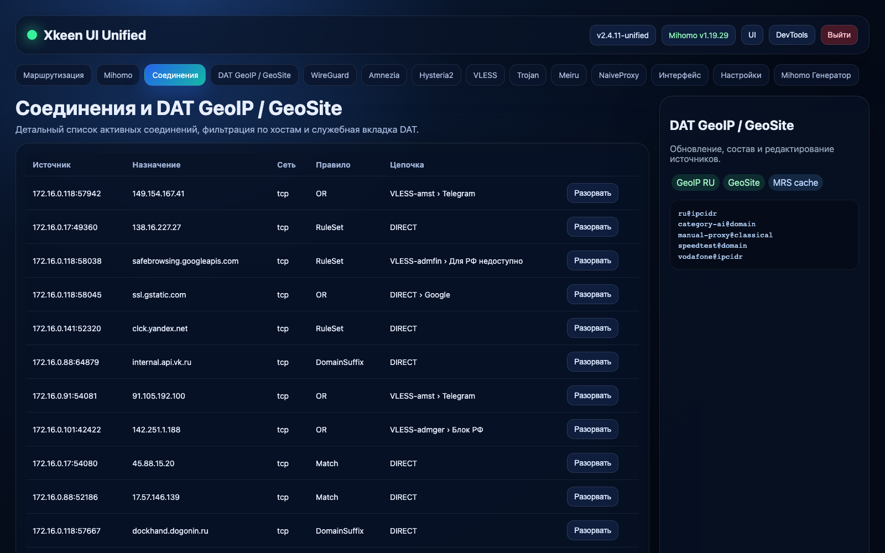

# Xkeen UI Unified

**Xkeen UI Unified** — форк [`umarcheh001/Xkeen-UI`](https://github.com/umarcheh001/Xkeen-UI), собранный под сценарий “одна панель для Keenetic + Entware + Mihomo”.

Главная цель: убрать зоопарк из Python-панели на `8088`, отдельного Zashboard на `9090/ui`, ручного SSH-редактирования YAML и вечного “а где это переключается?”. Основное управление Mihomo собрано в одной панели:

- **Маршрутизация** — runtime selectors Mihomo, плитки/списки, ping-и и ручной список;
- **Mihomo** — редактирование активного `config.yaml`, обновление подписок и YAML-инструменты;
- **Соединения** — список активных соединений Mihomo с деталями и разрывом соединений;
- **DAT GeoIP / GeoSite** — обновление, просмотр состава и работа с rule-provider/DAT;
- **WireGuard / Amnezia / Hysteria2 / VLESS / Trojan / Meiru / NaiveProxy** — импорт подключений ссылкой или файлом и добавление их в selector’ы;
- **Mihomo Генератор** — встроен в общую панель, без iframe-костылей.

> Панель рассчитана на локальную сеть. Не публикуйте её напрямую в интернет без отдельной авторизации/прокси-защиты. Интернету нельзя давать руль от роутера — он и так плохо себя ведёт.

---

## Скриншоты

### Маршрутизация Mihomo



### Селекторы плитками



### Селекторы списком



### Подключения по протоколам



### Соединения и DAT GeoIP / GeoSite



---

## Репозитории

| Что | Репозиторий |
|---|---|
| Unified UI | [`sllikmll/Xkeen-UI-umarcheh`](https://github.com/sllikmll/Xkeen-UI-umarcheh) |
| Mihomo fork | [`sllikmll/mihomo`](https://github.com/sllikmll/mihomo) |
| UI upstream | [`umarcheh001/Xkeen-UI`](https://github.com/umarcheh001/Xkeen-UI) |
| Старый XKeen UI источник фич | [`zxc-rv/XKeen-UI`](https://github.com/zxc-rv/XKeen-UI) |
| Mihomo upstream | [`MetaCubeX/mihomo`](https://github.com/MetaCubeX/mihomo) |

Почему репозиторий называется `Xkeen-UI-umarcheh`, а не просто `Xkeen-UI`: в аккаунте уже есть форк `sllikmll/XKeen-UI` от `zxc-rv/XKeen-UI`, а GitHub не различает имена репозиториев только по регистру букв. Да, регистр есть, но свободы нет. Классика.

---

## Что умеет этот форк

### Единая панель Mihomo на `8088`

| Раздел | Что делает |
|---|---|
| **Маршрутизация** | Runtime-переключение selector-групп Mihomo, плитки/списки, ping одного узла и всех узлов, inspector rule-provider payload |
| **Mihomo** | Активный профиль `config.yaml`, обновление подписок, YAML-инструменты |
| **Соединения** | Активные Mihomo connections, фильтрация, просмотр деталей, принудительный разрыв соединений |
| **DAT GeoIP / GeoSite** | Обновление DAT/rule-provider, просмотр состава, редактирование локальных списков |
| **Протоколы** | Импорт подключений через ссылку или файл и добавление managed proxy в selector’ы |
| **Mihomo Генератор** | Генератор конфига встроен в общую панель без отдельной страницы/iframe |

### Runtime selectors внутри панели

Вкладка **Маршрутизация** работает с Mihomo API напрямую:

- режим **Плитки** — по умолчанию;
- режим **Списки** — компактные строки `selector + dropdown`, чтобы много групп помещалось на одной странице;
- выбор сервера из подписки прямо из dropdown;
- ping рядом с узлом;
- клик по ping обновляет задержку конкретного узла;
- кнопка **Обновить все пинги**;
- поддержка provider-нод из `/providers/proxies`, а не только top-level `/proxies`;
- inspector справа показывает конечный payload rule-provider, включая decoded `.mrs` cache, а не бесполезную строку `RULE-SET -> selector`.

Подписочные узлы вроде `VLESS-amst` могут быть видны внутри selector-группы, но не существовать как отдельный ключ `/proxies/VLESS-amst`. Поэтому прямой запрос `/proxies/<name>/delay` может вернуть `404`. Форк мапит такие узлы через provider healthcheck. Да, пришлось пройти по минному полю, но теперь оно хотя бы размечено.

### Подключения по протоколам

В панели есть вкладки:

- **WireGuard**
- **Amnezia**
- **Hysteria2**
- **VLESS**
- **Trojan**
- **Meiru**
- **NaiveProxy**

Для каждой вкладки:

- импорт через ссылку или файл конфига;
- список уже добавленных подключений этого протокола;
- отображение protocol/type, имени, статуса Mihomo support;
- видно, в каких selector’ах подключение сейчас доступно;
- можно выбрать selector’ы, куда добавить подключение;
- `Preview` показывает managed YAML;
- `Применить в Mihomo` обновляет managed block в активном config.

Managed registry хранится на роутере:

```text
/opt/var/lib/xkeen-ui/proxy-connections.json
```

Mihomo-supported подключения вставляются внутрь существующего top-level `proxies:` между маркерами:

```yaml
# xkeen-managed-proxies:start
# ... generated proxy list ...
# xkeen-managed-proxies:end
```

Важно: форк **не** добавляет второй top-level `proxies:` в конец файла. Это был бы YAML-гремлин с ножом.

### Поддержка протоколов сейчас

| Протокол | Импорт | Mihomo injection | Статус |
|---|---:|---:|---|
| WireGuard | `.conf` | `type: wireguard` | рабочий путь |
| Amnezia / AWG | `.conf` | WireGuard-compatible outbound | рабочий путь, AWG-специфика сохраняется в registry |
| VLESS | `vless://` | `type: vless` | рабочий путь |
| Trojan | `trojan://` | `type: trojan` | parser/injection готовы, нужен серверный inbound для live-теста |
| Hysteria2 | `hy2://`, `hysteria2://` | `type: hysteria2` | parser/injection готовы, нужен серверный inbound для live-теста |
| NaiveProxy | `naive+https://` | HTTP/TLS outbound | parser/injection готовы, нужен серверный inbound для live-теста |
| Meiru | `mieru://` / raw config | registry/staging | отдельный runtime зависит от клиента/бинаря, в Mihomo не injected |

### Ручной список

Вкладка **Маршрутизация** содержит редактор:

```text
/opt/etc/mihomo/rules/manual-proxy.yaml
```

Файл сохраняется через backend панели с backup. Больше не нужно лезть в SSH ради пары доменов.

### Соединения

Вкладка **Соединения** проксирует Mihomo `/connections`:

- список активных соединений;
- фильтрация по хостам/источникам;
- детали соединения по клику;
- цепочка proxy/rule;
- принудительный разрыв конкретного соединения.

### DAT GeoIP / GeoSite

Отдельная вкладка для rule-provider/DAT:

- обновление;
- просмотр состава;
- работа с локальными списками;
- decoded cache для `.mrs`, когда Mihomo core умеет `convert-ruleset`.

### Unified installer

`install.sh` ставит не только Python-панель, но и standalone `mihomo`:

- проверяет/ставит `python3`;
- ставит Python-зависимости из bundled wheelhouse, а уже потом падает во внешний PyPI fallback;
- ставит `Flask`, `gevent`, `gevent-websocket`;
- ставит `lftp` для файлового менеджера;
- ставит или проверяет `/opt/sbin/mihomo`;
- создаёт стандартный layout `/opt/etc/mihomo`;
- создаёт symlink `config.yaml -> profiles/default.yaml`;
- создаёт `/opt/etc/mihomo/restart-mihomo.sh`;
- прописывает команды validate/restart в env панели;
- ставит optional xk-geodat;
- проверяет optional proxy-client artifacts для внешних runtime;
- регистрирует init-сервис `/opt/etc/init.d/S99xkeen-ui-umarcheh001`.

---

## Быстрая установка

На Keenetic с Entware:

```sh
cd /opt
curl -fL -o xkeen-ui-routing.tar.gz \
  "https://github.com/sllikmll/Xkeen-UI-umarcheh/releases/latest/download/xkeen-ui-routing.tar.gz"
tar -xzf xkeen-ui-routing.tar.gz
cd xkeen-ui
sh install.sh
```

После установки панель обычно доступна на:

```text
http://<IP_роутера>:8088/
```

Если `8088` занят, installer попробует:

```text
8091, затем 8100–8199
```

---

## Release asset

Основной установочный архив:

```text
xkeen-ui-routing.tar.gz
```

Latest:

```text
https://github.com/sllikmll/Xkeen-UI-umarcheh/releases/latest/download/xkeen-ui-routing.tar.gz
```

Checksum:

```text
https://github.com/sllikmll/Xkeen-UI-umarcheh/releases/latest/download/xkeen-ui-routing.tar.gz.sha256
```

---

## Управление установкой Mihomo

По умолчанию Mihomo ставится вместе с UI. Отключить:

```sh
XKEEN_INSTALL_MIHOMO=0 sh install.sh
```

Принудительно переустановить бинарник:

```sh
XKEEN_INSTALL_MIHOMO_FORCE=1 sh install.sh
```

Взять конкретный repo/tag:

```sh
XKEEN_MIHOMO_REPO=sllikmll/mihomo \
XKEEN_MIHOMO_TAG=v1.19.29 \
sh install.sh
```

Взять конкретный asset URL:

```sh
XKEEN_MIHOMO_ASSET_URL=https://example.com/mihomo-linux-arm64.gz sh install.sh
```

Installer сначала пробует релизы форка:

```text
sllikmll/mihomo
```

Если там нет release assets, автоматически использует upstream:

```text
MetaCubeX/mihomo
```

Это сделано специально, потому что GitHub forks не наследуют upstream release assets.

---

## Пути на роутере

| Назначение | Путь |
|---|---|
| UI | `/opt/etc/xkeen-ui` |
| UI init script | `/opt/etc/init.d/S99xkeen-ui-umarcheh001` |
| UI env/state | `/opt/etc/xkeen-ui/devtools.env` |
| Proxy connection registry | `/opt/var/lib/xkeen-ui/proxy-connections.json` |
| Mihomo binary | `/opt/sbin/mihomo` |
| Mihomo root | `/opt/etc/mihomo` |
| Active profile | `/opt/etc/mihomo/profiles/default.yaml` |
| Active config symlink | `/opt/etc/mihomo/config.yaml` |
| Mihomo restart script | `/opt/etc/mihomo/restart-mihomo.sh` |
| Manual proxy list | `/opt/etc/mihomo/rules/manual-proxy.yaml` |
| Rule-provider cache | `/opt/var/cache/xkeen-ui/rule-providers/` |
| UI logs | `/opt/var/log/xkeen-ui/` |
| Mihomo logs | `/opt/var/log/mihomo/` |

Ожидаемый symlink:

```sh
/opt/etc/mihomo/config.yaml -> profiles/default.yaml
```

---

## Управление сервисами

Панель:

```sh
/opt/etc/init.d/S99xkeen-ui-umarcheh001 start
/opt/etc/init.d/S99xkeen-ui-umarcheh001 stop
/opt/etc/init.d/S99xkeen-ui-umarcheh001 restart
/opt/etc/init.d/S99xkeen-ui-umarcheh001 status
```

Mihomo:

```sh
/opt/etc/mihomo/restart-mihomo.sh
```

Проверка Mihomo API:

```sh
wget -qO- http://127.0.0.1:9090/version
```

Проверка конфига:

```sh
/opt/sbin/mihomo -t -d /opt/etc/mihomo -f /opt/etc/mihomo/config.yaml
```

---

## Основные API панели для Mihomo

| Endpoint | Что делает |
|---|---|
| `GET /api/mihomo/clash/status` | Проверяет Mihomo `/version` |
| `GET /api/mihomo/clash/proxies` | Возвращает selectors + provider nodes |
| `PUT /api/mihomo/clash/proxies/<selector>` | Переключает selector runtime |
| `POST /api/mihomo/clash/proxies/<proxy>/delay` | Обновляет ping одного узла |
| `POST /api/mihomo/clash/proxies/delay-all` | Обновляет ping всех видимых узлов |
| `GET /api/mihomo/clash/connections` | Возвращает активные connections |
| `DELETE /api/mihomo/clash/connections/<id>` | Разрывает конкретное соединение |
| `GET /api/mihomo/manual-proxy` | Читает ручной список |
| `POST /api/mihomo/manual-proxy` | Сохраняет ручной список с backup |
| `GET /api/proxy-connections` | Список imported protocol connections |
| `POST /api/proxy-connections/import` | Импорт ссылки/файла подключения |
| `POST /api/proxy-connections/preview` | Preview generated managed YAML |
| `POST /api/proxy-connections/apply` | Применяет managed proxies в Mihomo config |

---

## Обновление

Если панель уже установлена:

```sh
cd /opt
curl -fL -o xkeen-ui-routing.tar.gz \
  "https://github.com/sllikmll/Xkeen-UI-umarcheh/releases/latest/download/xkeen-ui-routing.tar.gz"
tar -xzf xkeen-ui-routing.tar.gz
cd xkeen-ui
sh install.sh
```

Installer сохраняет существующий порт панели и не перетирает пользовательский Mihomo profile, если он уже есть.

На Keenetic нужен GNU `tar`; BusyBox `tar` слишком худой для части update-логики:

```sh
opkg update
opkg install tar
```

---

## Сброс логина/пароля

```sh
/opt/etc/init.d/S99xkeen-ui-umarcheh001 stop
rm -f /opt/etc/xkeen-ui/auth.json
/opt/etc/init.d/S99xkeen-ui-umarcheh001 start
```

После этого панель снова предложит первичную настройку доступа.

---

## Удаление

Быстро удалить панель:

```sh
sh /opt/etc/xkeen-ui/uninstall.sh
```

Дополнительная ручная очистка, если нужно снести хвосты:

```sh
rm -rf /opt/var/log/xkeen-ui
rm -f /opt/var/log/xkeen-ui.log
rm -f /opt/var/run/xkeen-ui.pid
rm -f /opt/bin/sysmon
rm -f /opt/bin/entware-backup
```

Если Mihomo больше не нужен:

```sh
rm -f /opt/sbin/mihomo
rm -rf /opt/etc/mihomo
rm -rf /opt/var/log/mihomo
rm -f /opt/var/run/mihomo.pid
```

Осторожно: удаление `/opt/etc/mihomo` снесёт профили, rule-providers и ручные списки. Без backup это будет не “очистка”, а маленький бытовой апокалипсис.

---

## Разработка

Сборка frontend:

```sh
npm run frontend:build
```

Генерация README-скриншотов из live read-only data:

```sh
node scripts/generate_readme_screenshots.mjs
```

Сборка пользовательского архива:

```sh
npm run archive:user
```

Быстрая проверка installer/API контрактов:

```sh
pytest tests/test_unified_mihomo_install_contract.py tests/test_install_script_pip_fallbacks.py -q
```

Расширенная проверка Mihomo/routing:

```sh
pytest -q tests -k 'mihomo or selector or install or routing'
```

---

## Статус проекта

Этот форк — практичная сборка под рабочий Keenetic/Entware setup:

- свежая Python-панель от `umarcheh001/Xkeen-UI`;
- идеи runtime-селекторов и ручного списка из `zxc-rv/XKeen-UI`;
- standalone Mihomo без legacy `xkeen` CLI;
- одна панель на `8088` вместо двух отдельных UI;
- managed protocol connections для WireGuard/Amnezia/VLESS/Trojan/Hysteria2/NaiveProxy;
- честный staging для Meiru, пока отдельный runtime не закреплён.

Фокус проекта — реальная эксплуатация на роутере, а не красивая демка, которая умирает при первом `restart`.
